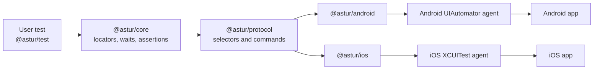
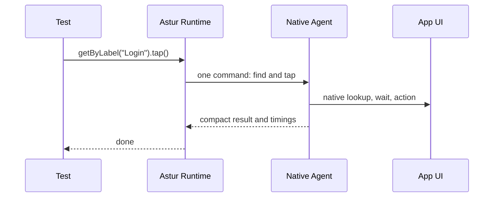
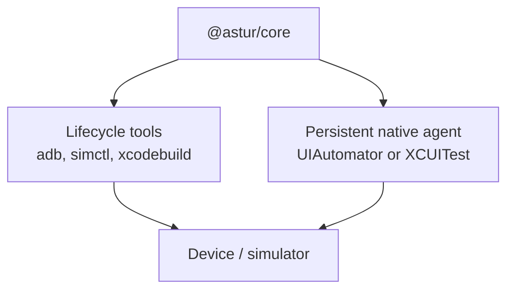
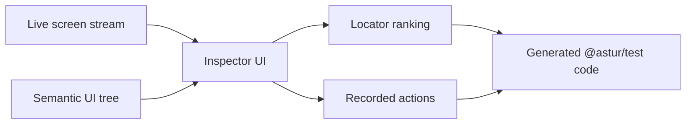

# Astur Architecture

Astur keeps the test authoring experience small while moving the expensive mobile work into native platform agents.



The public API remains Playwright-style:

```ts
await device.getByRole('button', { name: 'Sign in' }).tap();
await expect(device.getByText('Welcome')).toBeVisible();
```

The runtime below that API handles device selection, app lifecycle, native locator lookup, actionability checks, gestures, screenshots, video, traces, and inspector/codegen support.

## Why This Is Fast

Traditional Appium-style stacks usually add a WebDriver server between the test and the native automation framework. Astur avoids that extra protocol translation layer.



For common actions, Astur sends the intent once: find this element, wait until actionable, and tap it. The platform agent resolves and acts locally, so the host does not repeatedly pull large UI trees just to retry a locator.

## Lifecycle Vs Interaction

Astur still uses platform tools where they are the right tool:

- Android lifecycle: `adb` installs apps, launches packages, captures screenshots, records video, and gathers logs.
- iOS lifecycle: `simctl`, `devicectl`, and `xcodebuild` manage simulators, app install/launch, screenshots, and the XCUITest runner.
- Element interaction: native Android and iOS agents perform lookup, waits, taps, fills, drags, swipes, and keyboard commands.



This split keeps lifecycle reliable without putting slow shell commands in the normal element-interaction path.

## Inspector And Codegen

Astur Inspector uses the same runtime and selector model as tests.



The inspector does not invent a second locator system. When it suggests a locator, records a tap, or exports code, it uses the same platform-neutral locator contracts that execute during test runs.

## Reliability Rules

- Prefer semantic locators over coordinates.
- Keep native polling inside the platform agent.
- Use screenshots and UI snapshots for diagnostics, not as the default control path.
- Keep one platform agent alive per Playwright worker when possible.
- Reserve one physical device per Playwright worker; true parallelism requires multiple devices.
- When a config uses a loose device selector, let Astur choose an available matching device from the local pool instead of sending all workers to the same first device.
- Restart or reset the app between specs only when isolation requires it.
- Keep iOS XCTest requirements explicit instead of hiding them behind WebDriver.

## Package Shape

Most users install:

```bash
npm install -D @astur/test astur-mobile
```

`@astur/test` gives the Playwright fixture and assertions. `astur-mobile` gives the CLI, including `doctor`, `devices`, `init`, `test`, and `codegen`. Internal packages such as `@astur/core`, `@astur/android`, and `@astur/ios` stay published as normal npm packages so the project remains modular, but end users should not need to wire them manually.
