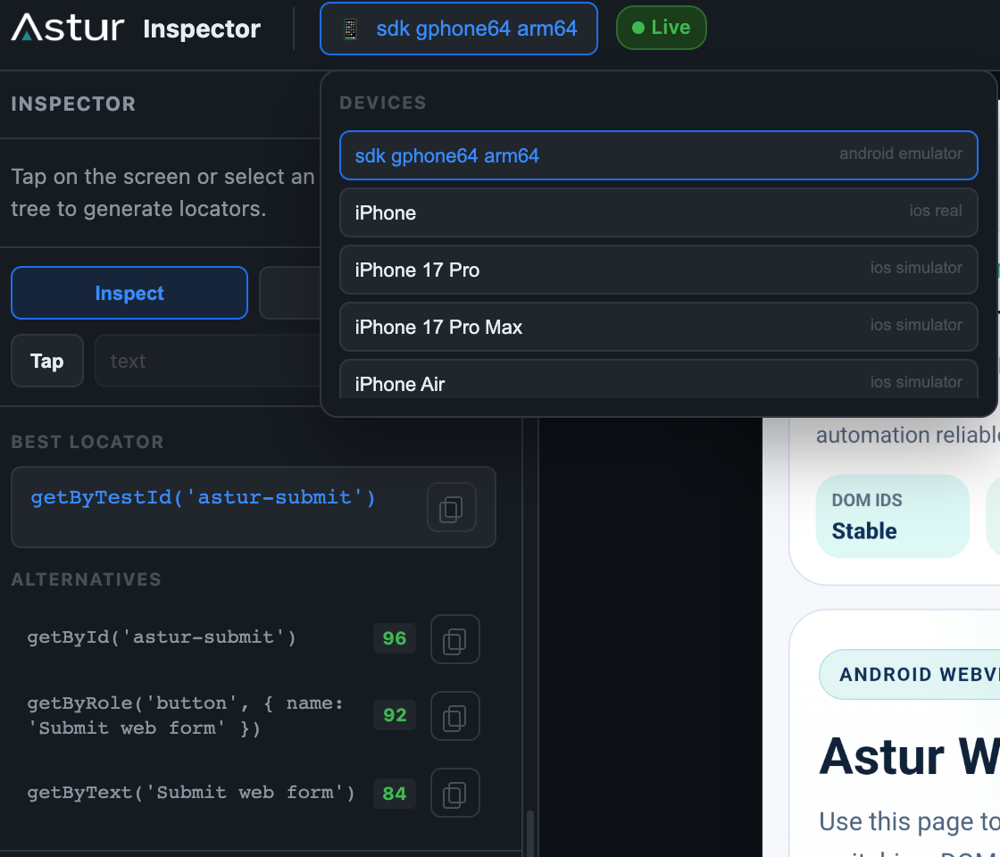
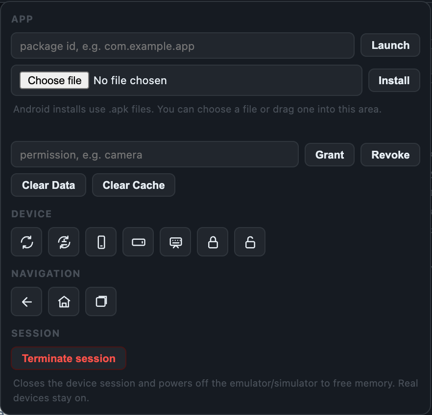
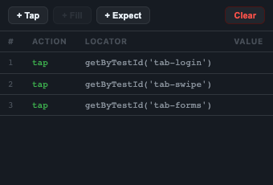
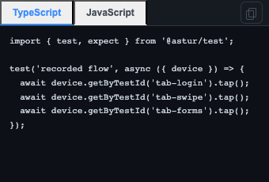

# Astur Inspector And Codegen

Astur Inspector is the visual authoring surface for mobile tests. It streams the device screen, reads the semantic UI tree through the same runtime used by tests, ranks locators, records actions, and exports `@astur-mobile/test` code.

Unlike generic WebDriver/Appium inspectors, Astur Inspector is built around Astur's own runtime. That gives it three practical advantages:

- generated locators use the same selector engine that will run in your tests
- taps, scrolls, fills, app launch, permissions, rotation, and screenshots go through the same native Android/iOS session used by `@astur-mobile/test`
- the inspector can rank semantic locators locally from the cached tree instead of waiting for a full remote round trip after every selection

The result is a more dynamic authoring loop: inspect, interact, record, edit the generated step, switch device, launch another installed app, and continue without changing tools.


Start it with:

```bash
npx astur-mobile codegen
```

Platform-specific examples:

```bash
npx astur-mobile codegen --android --device emulator-5554 --app ./MyApp.apk --app-id com.example.myapp
npx astur-mobile codegen --ios --simulator --app ./MyApp.app --app-id com.example.myapp
npx astur-mobile codegen --ios --real --device <device-udid> --app ./MyApp.ipa --app-id com.example.myapp
```

Plain `npx astur-mobile codegen --ios` defaults the iOS bundle id to `com.astur.demo`. For your own iOS app, pass `--app` and `--app-id` (or set `ASTUR_IOS_BUNDLE_ID`), or launch the app from the Inspector controls. To try Astur without a build, use the demo app from the Astur examples repository: `--app ./Astur.app --app-id com.astur.demo`.

## Header Controls

The header has two controls: the current-device chip and the `Controls` button.

### Switching Devices

The device chip shows the active device. Click it to open the device list and switch to another device without restarting the Inspector — across kinds and platforms: an Android emulator, a real Android device, an iOS simulator, or a real iOS device.



When you switch, Astur fully tears down the current device session **before** attaching the next one, so two native sessions never run at the same time (which otherwise doubles memory — two XCUITest runners, each holding a simulator, or two Android agents). The mirror briefly shows `Preparing device…` while the new device attaches.

Your original launch arguments carry to the new device when they still apply:

- the **app id** (bundle id / package) carries across the same platform, including iOS simulator ↔ real device
- the **`--app` artifact** only carries when it matches the target: `.apk` for Android, a simulator `.app` for an iOS simulator, a signed `.ipa` for a real iOS device

#### Switching limitations

- **iOS simulator ↔ real device** keeps the bundle id but not the app file — a simulator `.app` cannot be installed on a real device (it needs a signed `.ipa`), and vice versa. If the app is already installed on the target, the switch attaches to it; otherwise the switch cannot attach.
- **Cross-platform switches** (Android ↔ iOS) drop the app artifact entirely and inspect the device's current state, because `.apk` and `.app`/`.ipa` are not interchangeable.
- **Failed switches are non-destructive.** If Astur cannot attach to the chosen device, it re-attaches to the device you were on and reports `Switch to <device> failed: … — stayed on <previous>`, so the session stays usable instead of stranding you on a closed agent.
- **Real iOS devices** still require Apple signing, Developer Mode, and the app installed/signed for the device. The Inspector cannot create a signed build from a simulator `.app`; start a real-device session with `--ios --real --app <signed.ipa>` for full real-device control.

### Controls

The `Controls` button contains device, app, and session actions:

- install an APK, a simulator `.app`, or a real-device `.ipa`
- launch an installed app by package name or bundle id
- grant or revoke permissions
- clear app data/cache where supported
- rotate, refresh, lock/unlock, dismiss keyboard, and Android navigation actions
- **terminate the session** (Session row — see below)



iOS app launch from `Controls` also rebinds the XCUITest agent to the entered bundle id, so the UI tree and native interactions start working for that app.

### Terminating a Session

The **Terminate session** button (Controls → Session) ends the Inspector cleanly and reclaims all resources. After you confirm, Astur:

- closes the device session — stopping the native agent / XCUITest runner so host memory is released, and
- **powers off the emulator or simulator** so the virtual device stops consuming memory.

Real devices are left running — Astur does not power off hardware you own. The Inspector then shows a `Session terminated` overlay and the `codegen` process exits.

## Recording

Click `Record`, then interact with the mirrored screen.

- clicks execute a native coordinate tap first, then record the best semantic locator when one is available
- if no stable locator exists, Astur records `device.tap({ x, y })`
- mouse-wheel scrolling or dragging over the mirror performs a native swipe
- scrolling is available while inspecting and is recorded only when `Record` is active
- `+ Fill` and `+ Expect` use inline editors, not browser prompts
- assertions support visible, exact text, contained text, value, label, and type checks

Each interaction lands in the **Recording Steps** tab as an editable action + locator row:



The **Code** tab turns those steps into a ready-to-run `@astur-mobile/test` spec (toggle TypeScript or JavaScript, then copy):



Exported code is intentionally plain:

```ts
import { test, expect } from '@astur-mobile/test';

test('recorded flow', async ({ device }) => {
  await device.getByLabel('Email').fill('qa@example.com');
  await device.getByRole('button', { name: 'Login' }).tap();
  await expect(device.getByText('Welcome')).toBeVisible();
});
```

## iOS Tree Requirements

iOS simulator screenshots can appear before the tree is ready. On real iOS devices, the first mirrored frame also depends on the Swift XCUITest agent because Apple does not expose the same scriptable screenshot path through `devicectl`.

UI tree inspection and native interaction require the Swift XCUITest agent. If the right panel says the UI tree is unavailable:

<ol class="astur-steps">
  <li>Confirm the app is installed on the selected simulator or real device.</li>
  <li>Launch or rebind from <code>Controls</code> with the app bundle id.</li>
  <li>Or restart codegen with <code>--ios --app-id &lt;bundle-id&gt;</code>.</li>
  <li>For real devices, set <code>ASTUR_IOS_DEVELOPMENT_TEAM</code> so the XCUITest runner can be signed.</li>
  <li>If the terminal repeatedly shows <code>Password:</code>, unlock your macOS login keychain or allow codesign access for the Apple Development certificate.</li>
  <li>Check <code>npx astur-mobile doctor --verbose</code> if Xcode or the agent build fails.</li>
</ol>

:::note[Apple XCTest]
This is an Apple XCTest requirement. It is not an Appium or WebDriver dependency.
:::

:::tip[Refresh Delayed]
If the tree is visible but the header briefly says `UI tree refresh delayed`, Astur is keeping the last good tree while the next XCUITest snapshot is still running. The mirror remains usable; the warning should clear after the next successful tree refresh.
:::

## WebView DOM

When the device has an inspectable in-app WebView, the inspector **splices its DOM into the UI tree** under the native WebView host node. Each web element shows the same stable locator Astur generates for tests (`getByTestId` / `getById` / `getByRole` / `getByText`), and the **Fill** / **Tap** controls drive web elements by their DOM locator — no coordinate guessing.

This reuses `device.webContext()`, so it works for **Flutter and React Native** WebViews on Android (Chromium WebView/CDP) and on iOS — **both the simulator and real devices** — via `ios-webkit-debug-proxy`. The DOM is probed on a background cadence and never blocks the native tree. See [WebViews (DOM)](./frameworks/#webviews-dom) for setup and the platform support matrix.

## Platform Limits

Real iOS device execution is supported for USB-connected, trusted devices with Developer Mode enabled. It still needs Apple signing: set `ASTUR_IOS_DEVELOPMENT_TEAM`, use an app signed for the device, and set `ASTUR_IOS_AGENT_HOST` only if the phone cannot reach Astur's auto-detected Mac IP.

For real iOS devices, tests use targeted native commands and are the reliable path. Inspector tree rendering still depends on broad XCTest accessibility snapshots, so the mirrored screen becomes usable as soon as the agent can return frames, while the tree can arrive later or refresh slowly on large screens. Prefer iOS simulator for authoring/codegen when you need a fast live tree; use real devices for final smoke validation until the Inspector gains a compact native-tree stream.

System alert handling is limited by what XCTest exposes. Astur can query and interact with alerts XCTest can see, but iOS does not expose every system sheet or permission panel through normal app queries in a stable cross-version way.

iOS simulator app data/cache clearing is intentionally reset-by-reinstall. `simctl` supports install, uninstall, launch, terminate, and privacy controls, but it does not expose the same direct per-app data/cache clearing API that Android provides through package-manager commands.

The source in `agents/ios-xctest-agent/` is the bundled Swift XCUITest agent. It is the native iOS side of Astur: it binds to the app bundle id, reads the accessibility tree, performs native taps/fills/swipes, captures real-device screenshots, and returns compact JSON results to the Node.js runtime. It does not remove Apple's signing, provisioning, and system-UI restrictions for real devices.

## Performance Notes

Inspector selection uses the cached semantic tree for locator ranking, so clicking elements should not trigger a full tree read on every selection. Recording actions execute through native coordinate gestures first to avoid slow locator retries while the user is interacting with the mirror.

Scroll gestures are rate-limited on both the browser and server side. A fast trackpad scroll is collapsed into bounded native swipes so the device cannot receive an unbounded backlog of gestures.

The inspector server binds to `127.0.0.1` only. It grants full device control over an unauthenticated local connection, so it is intentionally not reachable from other machines on the network. Open the printed `http://localhost:<port>` URL on the same Mac that started the session.
