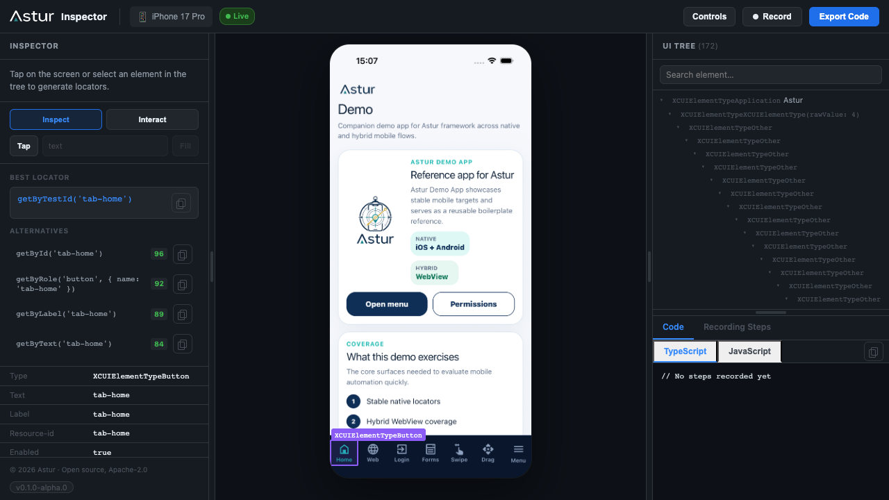

# iOS Setup

iOS automation is macOS-only. Astur uses Apple's own tooling instead of an Appium server:

- `simctl` for simulator lifecycle
- `devicectl` for real-device lifecycle
- `xcodebuild` to start the bundled Swift XCUITest runner
- the Astur XCUITest agent for native lookup, waits, gestures, screenshots, and keyboard control

Astur bootstraps the bundled agent automatically. Users should not build or install the agent manually for normal local runs, but real iOS devices still require an Apple signing team because XCTest runners must be signed. For USB-connected real devices, Astur prefers the Xcode/CoreDevice tunnel for the host bridge before falling back to a LAN address.

When everything is wired up, `codegen` streams a live device mirror, the full UI tree, and ready-to-paste locators:



## Preconditions At A Glance

| What you need | iOS Simulator | Real iPhone / iPad |
| --- | :---: | :---: |
| macOS + Xcode (opened once, license accepted) | Required | Required |
| Command line tools: `xcrun`, `simctl`, `xcodebuild` | Required | Required |
| iOS **simulator runtime** (Xcode → Settings → Platforms) | Required | — |
| `devicectl` (ships with Xcode) | — | Required |
| **App artifact** | Simulator-built **`.app`** | Device-signed **`.ipa`** |
| **Apple signing team** (`ASTUR_IOS_DEVELOPMENT_TEAM`) | Not needed | **Required** |
| Device trusted by the Mac + **Developer Mode** on | — | Required |
| XCUITest agent | Auto-built & started | Auto-built, **auto-signed** & started |

> **You never install or provision the agent by hand.** Astur builds and launches the bundled Swift XCUITest runner through Xcode on every session, and reuses a cached build (`DerivedData`) on later runs. On real devices it also *signs* that runner with your Apple team — the one extra step simulators skip. The artifact rule is the thing to remember: **simulator = `.app`, real device = `.ipa`.**

## Host Setup

Install Xcode, open it once, accept licenses, and install any requested components.

```bash
sudo xcode-select -s /Applications/Xcode.app/Contents/Developer
xcodebuild -version
npx astur-mobile doctor
```

## Choose A Path

Pick the smallest iOS setup that matches what you want to do:

| Goal | Build your app first? | Artifact | Apple signing? | Command |
| --- | --- | --- | --- | --- |
| Try Astur on a simulator with the demo app | No (download the demo `.app`) | `Astur.app` | No | `npx astur-mobile codegen --ios --simulator --app ./Astur.app --app-id com.astur.demo` |
| Inspect/test your own app on a simulator | Yes | Simulator-built `.app` | No | `npx astur-mobile codegen --ios --simulator --app ./MyApp.app --app-id com.example.myapp` |
| Inspect/test on a real iPhone or iPad | Yes | Device-signed `.ipa` | Yes | `npx astur-mobile codegen --ios --real --device <device-udid> --app ./MyApp.ipa --app-id com.example.myapp` |

> Want a ready-to-run app to try first? The Astur demo app (`Astur.app` for simulators, `astur.demo.ios.ipa` for real devices, bundle id `com.astur.demo`) ships in the Astur examples repository. Download it and point `--app` at it, or substitute your own build below.

## Simulator Setup

No Apple signing, no certificates — this is the fastest way to get onboarded.

**Step 1 — Install a simulator runtime** (once): Xcode → **Settings → Platforms** → add an iOS runtime.

**Step 2 — Verify the toolchain sees a simulator:**

```bash
xcrun simctl list devices available
npx astur-mobile devices --ios
```

**Step 3 — Launch Inspector/codegen.** Point `--app` at a simulator `.app` and pass its bundle id. To try Astur immediately, use the downloaded demo app; otherwise use your own build:

```bash
# Demo app (download Astur.app from the examples repo)
npx astur-mobile codegen --ios --simulator --app ./Astur.app --app-id com.astur.demo

# Your own app
npx astur-mobile codegen --ios --simulator --app ./MyApp.app --app-id com.example.myapp
```

A browser tab opens automatically. Within a few seconds you should see the live device mirror and a populated UI tree (see the screenshot above). The first run is slower because Xcode builds the agent once; later runs reuse the cached build.

### Use Your Own App On A Simulator

To inspect or test your own app on a simulator, you need to build the app first. Astur expects a simulator-built `.app` from Xcode and does not compile the app for you. A typical Xcode output path is inside DerivedData, such as `.../Build/Products/Debug-iphonesimulator/MyApp.app`.

For test runs, add Astur to your Playwright config and run `npx astur-mobile test`:

```ts
// playwright.config.ts
import { defineConfig } from '@astur-mobile/test';

export default defineConfig({
  testDir: './tests',
  use: {
    astur: {
      platform: 'ios',
      device: { kind: 'simulator', name: 'iPhone 16' },
      app: {
        path: './build/MyApp.app',
        bundleId: 'com.example.myapp'
      }
    }
  }
});
```

```bash
npx astur-mobile test                 # all tests
npx astur-mobile test tests/login.test.ts
```

## Real Device Setup

Real devices are the opposite tradeoff: **Apple signing is required.** Two things get signed, and Astur handles them differently:

1. **Your app** — you ship a device-signed `.ipa`. Astur does not sign your app for you.
2. **The XCUITest agent** — Astur builds and **signs it for you** at session start, but Apple requires a development team to do so. You provide that team; Astur does the rest (no manual provisioning profile juggling).

This signing setup does not exist on simulators.

**Step 1 — Prepare the device:**

1. Connect the iPhone/iPad by USB.
2. Tap **Trust** on the device when prompted.
3. Enable **Developer Mode** (Settings → Privacy & Security → Developer Mode) and reboot.
4. Add your Apple Developer account in **Xcode → Settings → Accounts**.

**Step 2 — Provide the signing team.** This is the single required variable for real devices:

```bash
export ASTUR_IOS_DEVELOPMENT_TEAM=ABCDE12345   # your 10-char Apple Team ID
```

> Find your Team ID in Xcode → Settings → Accounts → your team, or at [developer.apple.com](https://developer.apple.com/account) → Membership. When running from the source repo, Astur can also infer it from `agents/ios-xctest-agent/AsturIOSAgent.xcodeproj` if that project is already signed in Xcode — but for npm installs and CI, always set `ASTUR_IOS_DEVELOPMENT_TEAM` explicitly. Astur signs the agent with automatic provisioning (`-allowProvisioningUpdates`); set `ASTUR_IOS_CODE_SIGN_IDENTITY` only if your environment needs a specific identity.

**Step 3 — Make sure your `.ipa` is signed for this device.** The app's provisioning profile must include this device's UDID. If it does not, install/launch fails with `IOS_APP_INSTALL_SIGNATURE_INVALID`.

**Step 4 — Host bridge (usually automatic).** Astur advertises the Xcode/CoreDevice USB tunnel to the on-device agent automatically. Only set a Mac LAN IP if the phone cannot reach the auto-detected bridge:

```bash
export ASTUR_IOS_AGENT_HOST=192.168.0.14
```

> The first real-device run can take **several minutes** while Xcode builds and signs the agent. Subsequent runs reuse the cached build and start in seconds.

Verify the device:

```bash
xcrun devicectl list devices
npx astur-mobile devices --ios
```

`doctor` should report the connected real device, a configured signing team, and the bundled XCUITest agent project:

```bash
npx astur-mobile doctor --verbose
```

Real-device config:

```ts
import { defineConfig } from '@astur-mobile/test';

export default defineConfig({
  testDir: './tests',
  use: {
    astur: {
      platform: 'ios',
      device: {
        kind: 'real',
        id: '00008030-000548220EF0802E'
      },
      app: {
        path: './build/MyApp.ipa',
        bundleId: 'com.example.myapp'
      }
    }
  }
});
```

Then run the suite with the published CLI:

```bash
export ASTUR_IOS_DEVELOPMENT_TEAM=ABCDE12345
npx astur-mobile test
```

`bundleId` can be inferred from a local `.app` or `.ipa` when the app contains a readable `Info.plist`, but setting it explicitly is still recommended for CI. Make sure the `.ipa` is signed for the connected device — otherwise install fails with `IOS_APP_INSTALL_SIGNATURE_INVALID`.

## Defaults

Astur uses OS-aware defaults for iOS:

```ts
automation: {
  engine: 'agent',
  legacyFallback: 'never',
  startupTimeoutMs: 60_000,
  commandTimeoutMs: 15_000
},
agent: {
  mode: 'required',
  install: true
}
```

You normally omit these. Override them only when debugging a custom agent endpoint or a slow CI host.

## Keyboard And Fill

iOS text fill uses XCTest `typeText` for secure and short values, and a paste-backed path for longer non-secure replacement fills. This keeps password fields reliable while avoiding slow key-by-key entry for long text.

```ts
await device.getByTestId('forms-main-input').fill('Astur native form automation');
await device.keyboard.hide();
await device.keyboard.show(device.getByTestId('forms-main-input'));
```

Paste is also available as an explicit opt-in for non-secure fields:

```ts
await device.getByLabel('Bio').fill('Long local-only text', { textInputMode: 'paste' });
```

### Typing into a control the tree cannot describe

Some controls have no element to fill. A multi-box OTP field is the common one: the visible boxes are plain views and the real `UITextField` behind them is never exposed to XCUITest, so `getByType('textField')` finds nothing and `fill()` has no target.

`device.keyboard.type()` types into whatever currently holds **keyboard focus**, so it works where element-based fill cannot. Focus the control first — tapping a box normally does it:

```ts
await device.getByTestId('otp-input').tap();
await device.keyboard.type('123456');
```

The same call works on Android, which sends the characters to the focused view. A digit-by-digit flow is also portable, since `pressKey` accepts a single printable character on both platforms:

```ts
for (const digit of '123456') {
  await device.pressKey(digit);
}
```

Two things to know before reaching for it:

- **Prefer `fill()` whenever the field is addressable.** `fill()` resolves the element, clears it, and verifies the value landed. `keyboard.type()` targets focus, so nothing confirms where the characters went — that is the trade for reaching a control the tree cannot describe.
- **The keyboard must be up.** With no keyboard on screen there is nothing focused to type into, and the agent fails with `KEYBOARD_NOT_VISIBLE` rather than silently doing nothing.

Global keyboard behavior can be configured:

```ts
use: {
  astur: {
    platform: 'ios',
    keyboard: {
      dismiss: 'auto'
    }
  }
}
```

## Performance And Stability

iOS native automation runs through XCTest. Each tap, fill, swipe, and drag waits for the app to become idle (no in-flight UIKit/CoreAnimation work) before and after the event. This is what keeps XCTest reliable, but it also means anything that keeps the app animating makes individual actions slow or appear to hang until the command timeout. Two device settings remove the most common sources of this overhead. Apply them once on the simulator or real device you test on.

**Disable Password AutoFill.** When you focus a secure or login-styled field, iOS shows the Strong Password / AutoFill prompt over the keyboard. It animates in and out repeatedly, which keeps the app non-idle and makes `fill` on those fields slow even though the value is eventually typed. Turn it off for test devices:

```text
Settings > Passwords > Password Options > AutoFill Passwords  ->  off
```

**Enable Reduce Motion.** Shorter UIKit animations let XCTest reach the idle state faster, which speeds up gestures and prevents long stalls during animated transitions such as drag-and-drop snap effects:

```text
Settings > Accessibility > Motion > Reduce Motion  ->  on
```

Additional guidance:

- Expose stable accessibility identifiers for every control you interact with. `getByTestId` / `getById` resolve in one query; broad text or role enumeration is inherently slower, especially on real devices.
- Keep custom in-app animations short or non-looping on screens under test. A continuously animating view never lets XCTest reach idle, so the next action waits the full command timeout before failing.
- Long non-secure replacement fills use paste to avoid slow key-by-key input. Secure fields always type, and `{ textInputMode: 'type' }` forces key-by-key input when an app rejects paste.

## Inspector On iOS

`codegen` launches the Astur Inspector — a live device mirror, the XCUITest UI tree, point-and-click locator generation, and step recording that exports a ready-to-run test (shown at the top of this page). See [Inspector And Codegen](../inspector/) for the full panel-by-panel walkthrough.

Start codegen with an app path and bundle id that match your target:

```bash
# Simulator (.app, no signing)
npx astur-mobile codegen --ios --simulator --app ./MyApp.app --app-id com.example.myapp

# Real device (.ipa, needs ASTUR_IOS_DEVELOPMENT_TEAM)
npx astur-mobile codegen --ios --real --device <device-udid> --app ./MyApp.ipa --app-id com.example.myapp
```

To target a specific simulator/device instead of the first match, add `--device <device-udid>` (find UDIDs with `npx astur-mobile devices --ios`).

### Verify It Works

The session is healthy when, in the browser tab that opens:

1. The status badge turns **Live** (top-left, green).
2. The centre panel shows a **live mirror** of the device screen.
3. The right **UI TREE** panel fills with elements.
4. Clicking an element (or a node in the tree) generates locator suggestions on the left.

If the badge stays on **Connecting…** or the mirror never appears, see [Troubleshooting → Inspector never becomes ready](../troubleshooting/).

### If App Or Agent Is Missing

Use this rule of thumb for command choice:

- First run or app not installed yet: include `--app` so Astur can install before attaching.
- App already installed: `--app-id` is enough.
- If app is missing and you pass only `--app-id`, Astur returns `IOS_APP_NOT_INSTALLED`.

Example commands:

```bash
# Simulator, install + attach in one command.
npx astur-mobile codegen --ios --simulator --app ./MyApp.app --app-id com.example.myapp

# Real device, install + attach in one command.
ASTUR_IOS_DEVELOPMENT_TEAM=ABCDE12345 \
npx astur-mobile codegen --ios --real --device <device-udid> --app ./MyApp.ipa --app-id com.example.myapp

# Already-installed app, path omitted.
npx astur-mobile codegen --ios --simulator --app-id com.example.myapp
```

Astur iOS agent behavior:

- No manual agent install step is required on simulator or real device.
- Astur starts the bundled Swift XCUITest runner automatically for each session.
- On both simulator and real device, the mirror, UI tree, screenshots, and native interactions are all served by the XCUITest agent once it is started and bound to the target bundle id.
- Simulator failures are usually Xcode/runtime boot issues.
- Real-device failures usually require signing setup (`ASTUR_IOS_DEVELOPMENT_TEAM`, trusted device, unlocked keychain).

For failure-specific fixes, see [Troubleshooting](../troubleshooting/).

### Automatic Session Cleanup

Astur owns the lifecycle of the XCUITest agent so it never leaves a session holding your device:

- Each agent runs in its own process group, so a normal exit or `Ctrl-C` tears down both `xcodebuild` and the test runner it spawns.
- Before starting a new session, Astur reaps any leftover agent process for the same project + device (for example, after a previous run was force-killed). Disable this with `ASTUR_IOS_AGENT_REAP=0` if you manage an external, shared agent yourself.

### Debugging The Agent

```bash
# Log every command the host queues, delivers, and gets a response for.
ASTUR_IOS_AGENT_TRACE=1 npx astur-mobile codegen --ios --simulator --app ./MyApp.app --app-id com.example.myapp
```

See [Configuration → iOS environment variables](../configuration/) for the full list (agent project/scheme overrides, ports, derived-data path, signing identity, and tool paths).

## Real-Device Transport

Astur real-device execution has two connections:

| Connection | Owned by | Notes |
| --- | --- | --- |
| App lifecycle | `devicectl` + XCUITest agent | `devicectl` installs, uninstalls, and lists devices. Once the agent is attached, app launch/terminate is routed through XCUITest so the runner and app stay bound to the same session. |
| Native automation | Astur XCUITest agent | Reads the UI tree, performs taps/fills/swipes, handles orientation, and captures screenshots. |
| Host bridge | Astur runtime | Uses the CoreDevice USB tunnel when available; falls back to `ASTUR_IOS_AGENT_HOST` or a reachable Mac address. |

If the XCUITest output contains `Local network prohibited`, keep the device connected by USB and remove any forced `ASTUR_IOS_AGENT_HOST` value so Astur can use the CoreDevice tunnel. Only force `ASTUR_IOS_AGENT_HOST` for environments where the phone can reach the Mac over the network and the local network permission is allowed.

## Supported Operations

| API | Simulator | Real device | Notes |
| --- | --- | --- | --- |
| `device.app.install()` | Yes | Yes | Use a simulator-built `.app` on simulators. Use a device-signed `.ipa` on real devices. Astur unwraps IPA contents internally before install. |
| `device.app.launch()` | Yes | Yes | Launches the configured bundle id. |
| `device.app.terminate()` | Yes | Yes | Real devices terminate by matching the launched app process. |
| `device.app.reset({ reinstall: true, launch: true })` | Yes | Yes | Uninstall/reinstall reset. |
| `device.app.uninstall()` | Yes | Yes | Removes the configured bundle id. |
| `device.permissions.grant('camera')` | Yes | No | Uses `simctl privacy`; Apple does not expose equivalent real-device control. |
| `device.permissions.revoke('camera')` | Yes | No | Same limitation as grant. |
| `device.setOrientation('landscape')` | Yes | Yes | Routed through the XCUITest agent for native UI sessions. |
| `device.orientation.portrait()` | Yes | Yes | Convenience wrapper. |
| `device.lock()` / `device.unlock()` | Yes | No | Simulators support screen power control; real devices must be managed manually. |
| `device.screenshot()` | Yes | Yes | Real devices capture through the XCUITest agent. |
| Video recording | Yes | No | Simulator-only for now. If enabled on a real device, Astur skips the native video attachment instead of failing the test. |
| Native locators and gestures | Yes | Yes | Requires the XCUITest agent. |
| `locator.scrollIntoView()` | Yes | Yes | Cross-platform. Swipes within the viewport (or a given container) until the element is visible. See the Android docs for options. |

For fastest real-device execution, expose stable accessibility identifiers for controls and dynamic values. XCTest can tap and fill by id quickly, but broad text enumeration such as "find every visible number on the screen" is inherently slower on real devices.

## Native Selector Escape Hatch (`by.native`)

For the rare element `by.label`/`by.id`/`by.text`/`by.role`/`by.type` cannot
express, `by.native()` accepts a raw XCUITest `NSPredicate` format string,
applied via `app.descendants(matching: .any).matching(NSPredicate(format:))`
— the same declarative predicate grammar Apple's own APIs and Appium's `-ios
predicate string` strategy use. It is data for a restricted query language,
never executed as code:

```ts
await device.find(by.native({
  ios: "type == 'Button' AND label CONTAINS[cd] 'Save'"
})).tap();

// Disambiguate identical matches by position (0-based):
await device.find(by.native({
  ios: "type == 'StaticText' AND label == 'Delete'",
  instance: 2
})).tap();
```

Because `NSPredicate` can combine any number of conditions in one string
(`AND`/`OR`, `CONTAINS`/`BEGINSWITH`/`MATCHES`, case-insensitive `[cd]`),
most disambiguation needs are one predicate away without needing positional
indexing at all.

`by.native()` requires a connected native agent — it cannot be resolved
against a cached UI-tree snapshot, so a legacy/no-agent session throws
`NATIVE_SELECTOR_REQUIRES_AGENT` rather than silently matching nothing. To
target Android with the same locator, add an `android` chain alongside
`ios` — see [Android: Native Selector Escape Hatch](../android/#native-selector-escape-hatch-bynative).

## Known Apple Limits

- Real iOS apps and XCTest runners must be signed with your team.
- System alerts are automatable only when XCTest exposes them to the test runner.
- Direct per-app data/cache clearing is not public on iOS; use uninstall/reinstall reset.
- Real-device lock/unlock and permission mutation are not reliable through public local tooling.

The agent source lives in:

```text
agents/ios-xctest-agent/
```

It binds to the app bundle id, reads the accessibility tree, performs native actions, and bridges compact JSON results back to the Node.js runtime.
