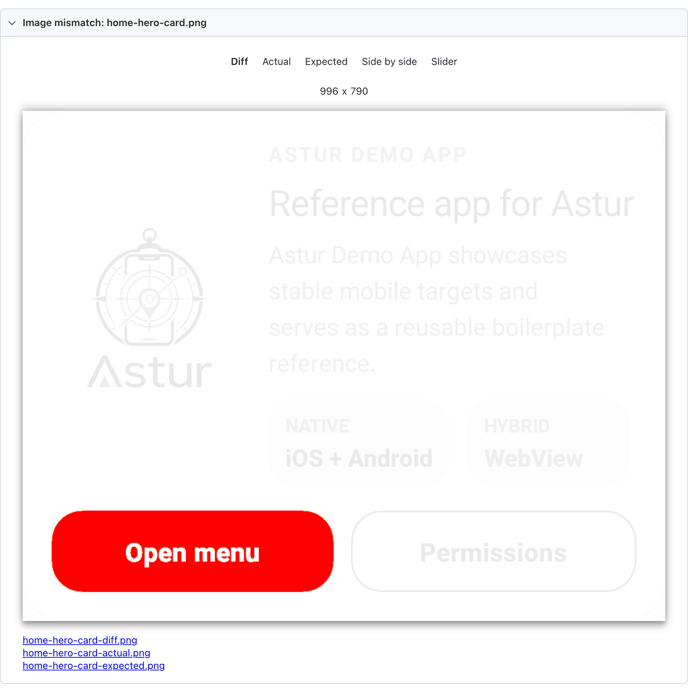
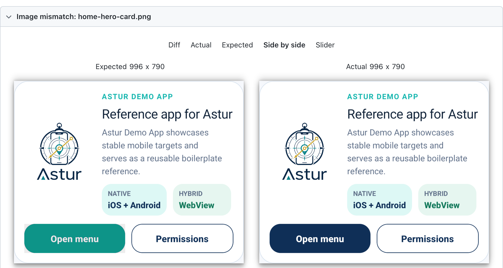

# Visual Comparison

`toHaveScreenshot()` compares what the screen looks like against a stored baseline image, so a change in appearance fails a test instead of going unnoticed.

```ts
await expect(app.home.heroCard).toHaveScreenshot('home-hero-card.png');
```

Playwright's own `expect(page).toHaveScreenshot()` needs a `Page`, and a native session does not have one. This is the native equivalent: Astur captures through the device, paints over whatever is allowed to change, and compares against one baseline per device. It works the same way on React Native and Flutter, Android and iOS.

## Why bother

Functional assertions check that an element is there and says the right thing. They pass happily while a button turns invisible against its background, a card loses its padding, or an icon stops rendering — because `toBeVisible()` and `toHaveText()` are all still true.

A visual assertion is the one that notices. It is worth reaching for when:

- **A component's appearance is the product** — a design system, a themed component, a chart.
- **A refactor should change nothing visible.** Swapping a layout primitive or bumping a UI library is exactly where an unnoticed shift happens.
- **A bug was visual once already.** A baseline is a cheap regression test for the thing that broke.

It is the wrong tool for asserting behaviour. Prefer a functional assertion whenever one can express what you mean: it is faster, it survives a font rendering change, and it says what it wants.

## What a failure looks like

When a comparison fails, the expected, actual, and diff images are attached to the Playwright HTML report, which renders them as an image diff:



The **Diff** tab fades everything that matched and highlights what moved — here, only the primary button changed colour. **Side by side** shows the two images together, which is usually the quickest way to judge whether a change was intended:



The failure message names the scale of the difference so it is usable from a CI log alone, without opening the report:

```
Screenshot home-hero-card.png does not match its baseline: 49888 pixels differ
(6.34% of the image).
Baseline: specs/visual-comparison.test.ts-snapshots/android-native-1080x2424/home-hero-card.png
Re-run with --update-snapshots once you have confirmed the change is intended.
```

## First run writes the baseline

There is no baseline the first time, so the assertion writes one and **fails**:

```
No baseline yet, so this run wrote one:
  specs/visual-comparison.test.ts-snapshots/android-native-1080x2424/home-hero-card.png
Check the image looks right, commit it, and re-run.
```

That failure is deliberate. A run that quietly creates a baseline has asserted nothing, and on CI it turns a missing baseline into a green test that never compared anything. Look at the image, commit it, and the next run compares against it.

To accept an intended change, re-run with Playwright's `--update-snapshots`.

## Compare an element, not the whole screen

Prefer an element wherever you can:

```ts
await expect(app.home.heroCard).toHaveScreenshot('home-hero-card.png');
```

A full-screen baseline includes the system status bar, whose clock changes every minute and which no application locator can mask. That single detail is enough to make a full-screen assertion fail for reasons nobody cares about.

Element screenshots crop out of a full-screen capture. Astur scales the element's bounds into screenshot pixels for you, which is not a no-op everywhere: Android reports bounds in physical pixels, while iOS reports points against a 3x image.

## Mask what is genuinely dynamic

A timestamp, a live counter, an avatar — mask it rather than loosening the threshold:

```ts
await expect(card).toHaveScreenshot('forms-fields-card.png', {
  mask: [app.forms.textInput, app.forms.mirror]
});
```

Masked regions are painted magenta before comparison, so a mask that lands in the wrong place is obvious in the attached image rather than silently hiding a regression. A mask locator that matches nothing is skipped, because an element that only appears sometimes is a normal reason to mask it.

Reach for a mask before a threshold. A wide threshold hides real regressions everywhere on the screen; a mask hides one region on purpose.

## Baselines are per device

Baselines are stored under a directory naming the platform, UI engine, and screen size:

```
visual-comparison.test.ts-snapshots/
  android-native-1080x2424/
  android-flutter-1080x2424/
  ios-native-393x852/
```

Resolution alone is not enough. A React Native and a Flutter build of the same screen do not render identically on the same emulator, so they need separate baselines.

If a comparison runs against a baseline from a different device, Astur says so rather than printing a pixel count:

```
screenshot size does not match the baseline — baseline is 996x790, this run
captured 1083x1191. This usually means the baseline was recorded on a different
device rather than that the UI changed.
```

## Tolerances

By default any differing pixel fails, matching Playwright. Per-pixel colour noise is already absorbed by `threshold` (0.2) before pixels are counted.

| Option | What it does |
| --- | --- |
| `threshold` | Per-pixel colour tolerance, 0–1. Default `0.2`. |
| `maxDiffPixels` | Allowed number of differing pixels. |
| `maxDiffPixelRatio` | Allowed proportion of differing pixels, 0–1. |
| `mask` | Locators to paint over before comparing. |
| `stabilizeTimeout` | How long to wait for the screen to stop changing. Default 1500 ms. |

Set both `maxDiffPixels` and `maxDiffPixelRatio` and both must hold, so raising one cannot silently widen the other.

**A budget is often necessary on mobile.** Re-rendering the same card after a scroll or a keyboard change moves roughly 0.2% of its pixels, because text lands on slightly different sub-pixel positions. Measure your own screens rather than guessing:

```ts
await expect(card).toHaveScreenshot('card.png', { maxDiffPixelRatio: 0.01 });
```

A budget stays far tighter than loosening `threshold`: a real change — colour, copy, spacing — moves well over 1% of a card.

## Animations

Before comparing, Astur captures repeatedly until two consecutive captures are identical, up to `stabilizeTimeout`. Without that, a ripple, fade, or spinner still settling gets recorded as the baseline or compared against one, and the test fails for reasons unrelated to the change under test.

Set `stabilizeTimeout: 0` to capture immediately.

## When a comparison fails

The expected, actual, and diff images are attached to the Playwright report, so you can see what moved instead of guessing from a pixel count.

## Worth knowing before you rely on it

Visual assertions are the most environment-sensitive tests Astur ships. They are sensitive to OS version, device model, font rendering, and animation timing — all things that can change without your app changing.

That is a reason to scope them tightly, not to avoid them: assert on the component you care about, mask what moves, and keep baselines per device. A handful of focused element baselines catches real regressions and stays quiet. A screenful of pixels does neither.
